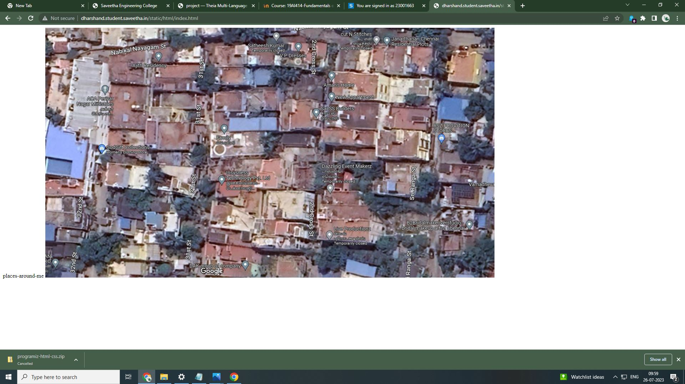
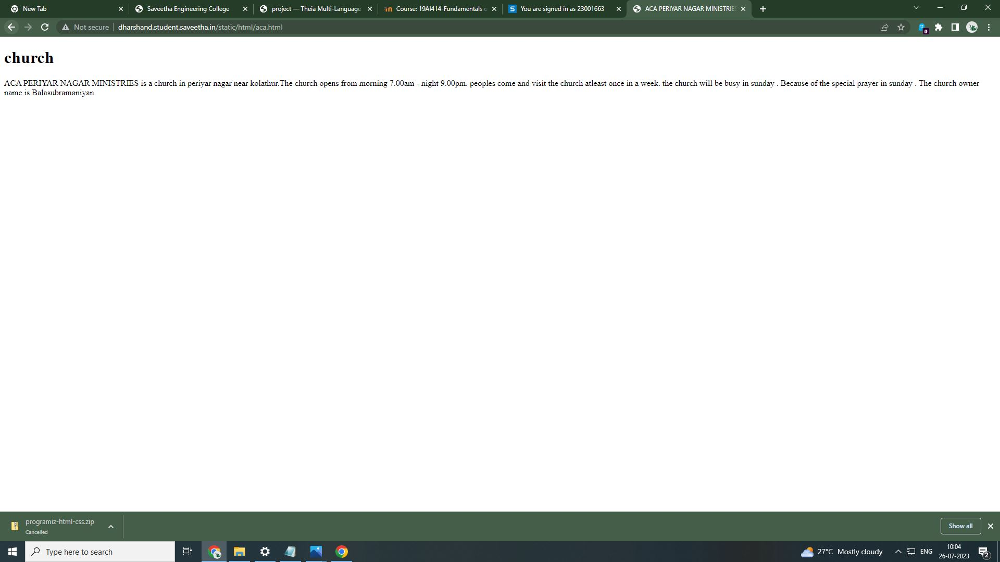
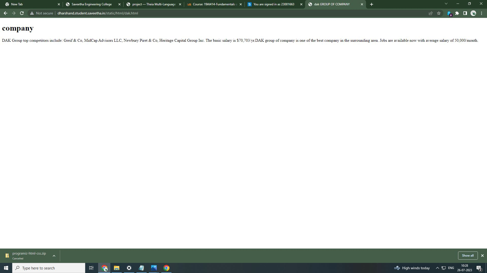
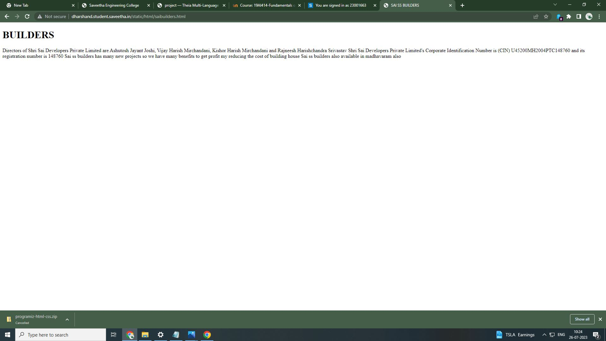
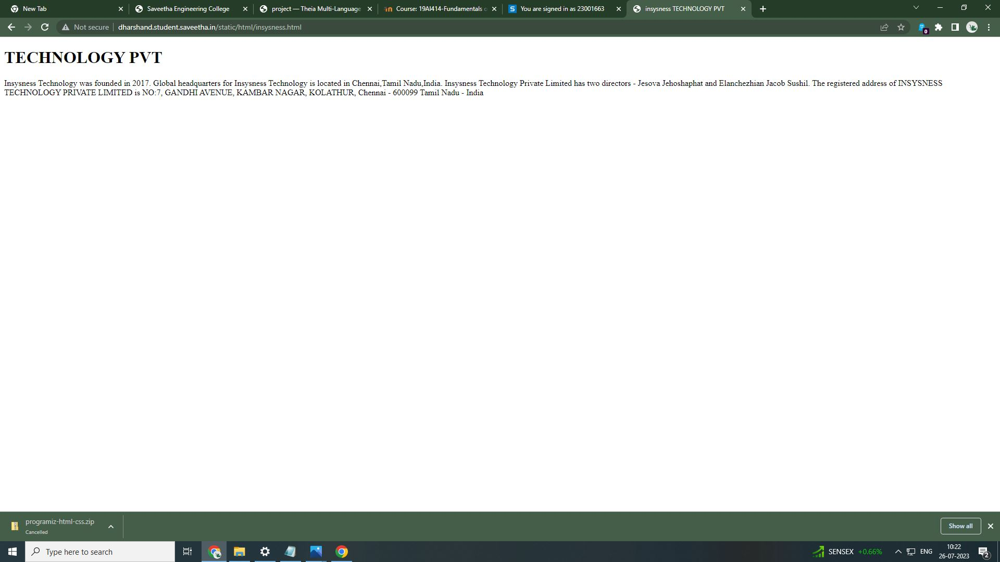
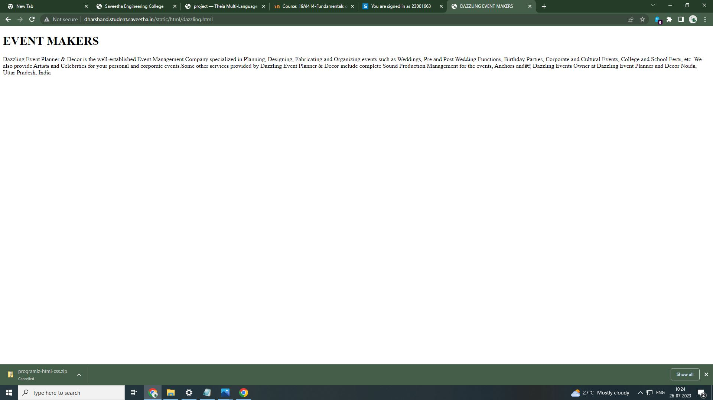

# Places Around Me
## AIM:
To develop a website to display details about the places around my house.

## Design Steps:

### Step 1:
upload the html text of the placesaround .
### Step 2:
now run the server and take the screenshot of the outputs.
## Code:
<!DOCTYPE html>
<html>
     <head>
            <tittle>places-around-me</tittle>
     </head>

<body>

<map name="image-maps-2023-07-24-053756" id="ImageMapsCom-image-maps-2023-07-24-053756">
<area  alt="" title="aca" href="/static/html/aca.html" shape="rect" coords="145,151,195,201" style="outline:none;" target="_self"     />
<area  alt="" title="saibulders" href="/static/html/saibuilders.html" shape="rect" coords="725,220,788,270" style="outline:none;" target="_self"     />
<area  alt="" title="insysness" href="/static/html/insysness.html" shape="rect" coords="473,418,526,468" style="outline:none;" target="_self"     />
<area  alt="" title="dazzling" href="/static/html/dazzling.html" shape="rect" coords="774,424,827,474" style="outline:none;" target="_self"     />
<area  alt="" title="dak" href="/static/html/dak.html" shape="rect" coords="523,649,592,690" style="outline:none;" target="_self"     />
</map>

</body>
</html>
## Output:

## Result:
The program is created successfully.
