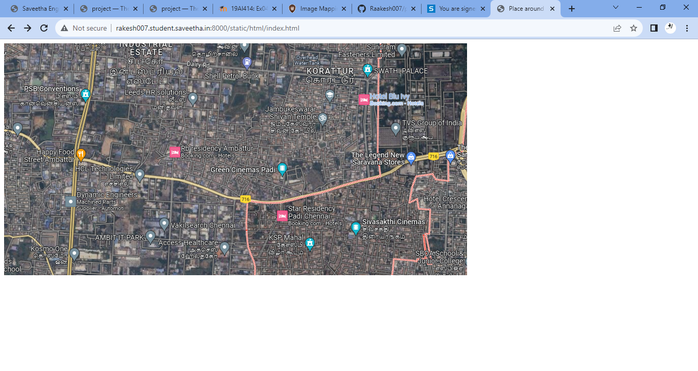
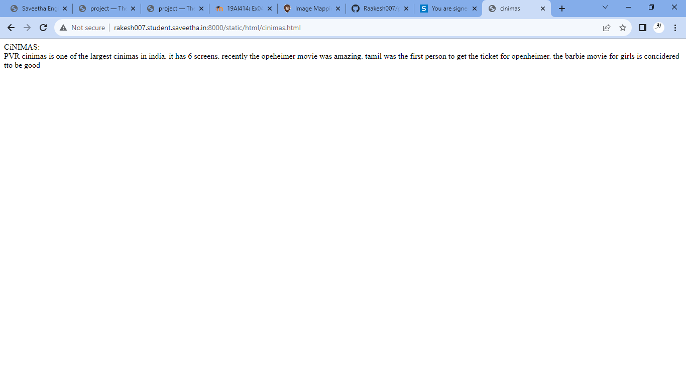
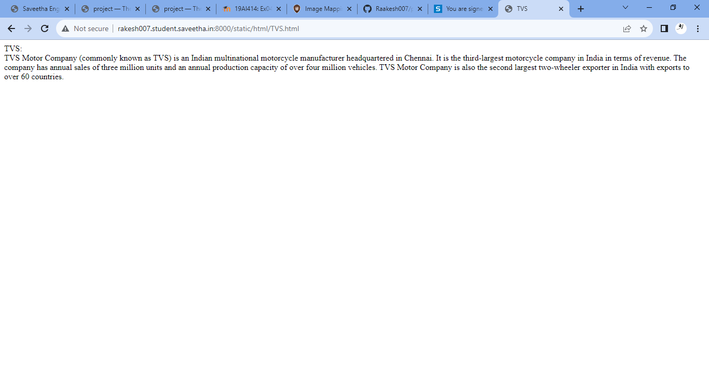
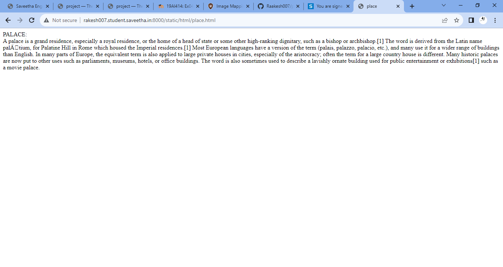
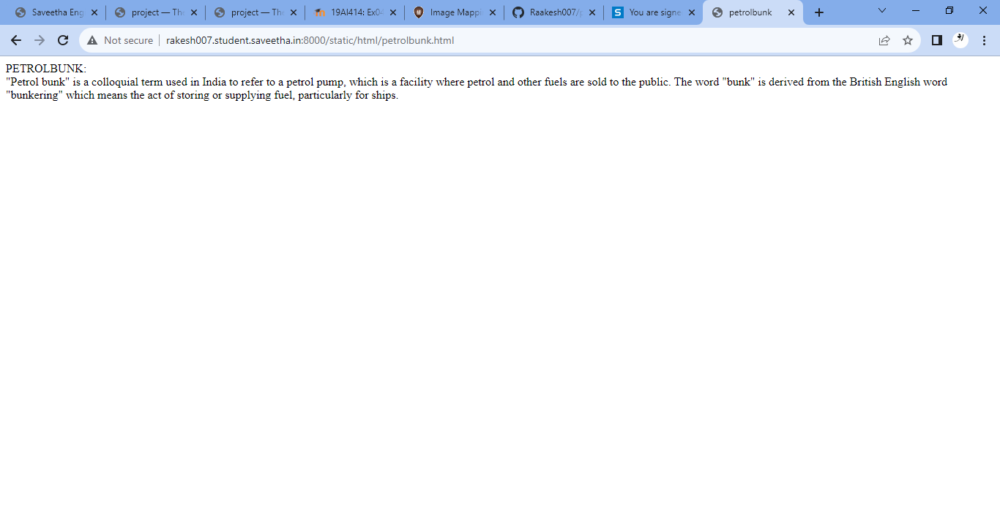
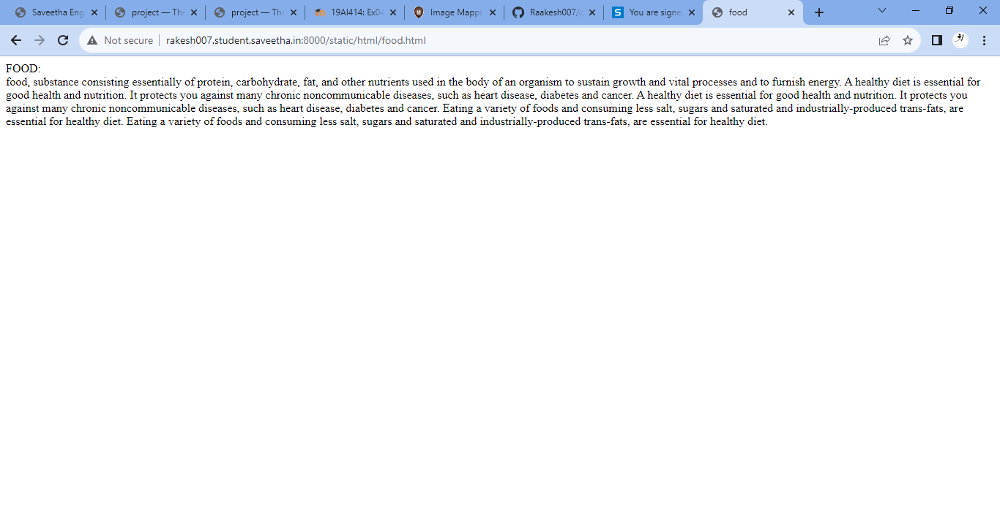

# Places Around Me
## AIM:
To develop a website to display details about the places around my house.

## Design Steps:

### Step 1:
clone the github repository into theria IDE.
### Step 2:
create a new django project
### step 3:
write the needed HTML code.
### step 4:
run the Django server and execute the HTML code.

## Code:
```
index.html:
<!DOCTYPE html>
<html>
<head>
    <title>Place around me</title>
</head>
<body>

<map name="image-maps-2023-07-25-145802" id="ImageMapsCom-image-maps-2023-07-25-145802">
<area  alt="" title="cinemas" href="cinimas.html" shape="rect" coords="671,342,721,392" style="outline:none;" target="_self"     />
<area  alt="" title="TVS" href="TVS.html" shape="rect" coords="745,149,795,199" style="outline:none;" target="_self"     />
<area  alt="" title="palace" href="place.html" shape="rect" coords="693,36,743,86" style="outline:none;" target="_self"     />
<area  alt="" title="food" href="food.html" shape="rect" coords="132,199,182,249" style="outline:none;" target="_self"     />
<area  alt="" title="petrolbunk" href="petrolbunk.html" shape="rect" coords="457,20,507,70" style="outline:none;" target="_self"     />
<area shape="rect" coords="904,453,906,455" alt="Image Map" style="outline:none;" title="Image Map" href="https://www.image-maps.com/" />
</map>
</body>
</html>

cinimas.html:
<!DOCTYPE html>
<html>
    <head>
        <title>cinimas</title>
    </head>
    <body>
        CiNIMAS:
        <br>
        PVR cinimas is one of the largest cinimas in india.
        it has 6 screens. recently the opeheimer movie was amazing.
        tamil was the first person to get the ticket for openheimer.
        the barbie movie for girls is concidered tto be good
    </body>
</html>

food.html:
<!DOCTYPE html>
<html>
    <head>
        <title>food</title>
    </head>
    <body>
        FOOD:
        <br>
        food, substance consisting essentially of protein, carbohydrate, fat, and other nutrients used in the body of an organism to sustain growth and vital processes and to furnish energy.
        A healthy diet is essential for good health and nutrition. It protects you against many chronic noncommunicable diseases, such as heart disease, diabetes and cancer.
        A healthy diet is essential for good health and nutrition. It protects you against many chronic noncommunicable diseases, such as heart disease, diabetes and cancer. Eating a variety of foods and consuming less salt, sugars and saturated and industrially-produced trans-fats, are essential for healthy diet.
        Eating a variety of foods and consuming less salt, sugars and saturated and industrially-produced trans-fats, are essential for healthy diet.
    </body>
</html>

petrolbunk.html:
<!DOCTYPE html>
<html>
    <head>
        <title>petrolbunk</title>
    </head>
    <body>
        PETROLBUNK:
        <br>
        "Petrol bunk" is a colloquial term used in India to refer to a petrol pump, which is a facility where petrol and other fuels are sold to the public.
        The word "bunk" is derived from the British English word "bunkering" which means the act of storing or supplying fuel, particularly for ships.
    </body>
</html>

place.html:
<!DOCTYPE html>
<html>
    <head>
        <title>place</title>
    </head>
    <body>
        PALACE:
        <br>
        A palace is a grand residence, especially a royal residence, or the home of a head of state or some other high-ranking dignitary, such as a bishop or archbishop.[1] The word is derived from the Latin name palātium, for Palatine Hill in Rome which housed the Imperial residences.[1] Most European languages have a version of the term (palais, palazzo, palacio, etc.), and many use it for a wider range of buildings than English. In many parts of Europe, the equivalent term is also applied to large private houses in cities, especially of the aristocracy; often the term for a large country house is different. Many historic palaces are now put to other uses such as parliaments, museums, hotels, or office buildings. 
        The word is also sometimes used to describe a lavishly ornate building used for public entertainment or exhibitions[1] such as a movie palace.
    </body>
</html>

TVS.html:
<!DOCTYPE html>
<html>
    <head>
        <title>TVS</title>
    </head>
    <body>
        TVS:
        <br>
        TVS Motor Company (commonly known as TVS) is an Indian multinational motorcycle manufacturer headquartered in Chennai. It is the third-largest motorcycle company in India in terms of revenue. The company has annual sales of three million units and an annual production capacity of over four million vehicles. 
        TVS Motor Company is also the second largest two-wheeler exporter in India with exports to over 60 countries.
    </body>
</html>
```

## Output:












## Result:
The program is executed successfully.